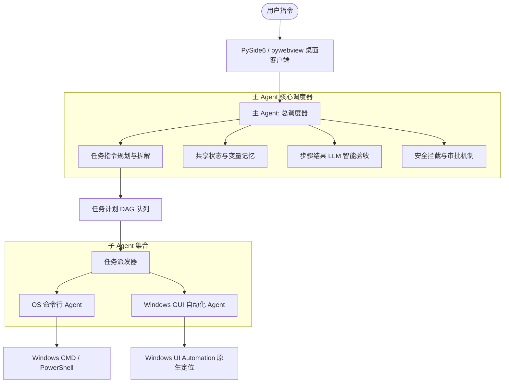

# Windows 多 Agent 协同自动化桌面助手 (Windows-Auto)

这是一个可在 Windows 平台运行、基于大模型协同的桌面自动化与系统控制应用。系统采用 **“主 Agent (总调度) + 专用子 Agent (命令行/GUI/浏览器)”** 的协同架构，能够智能解析用户输入的自然语言任务，动态规划任务步骤，分发给专属 Agent 执行并自主进行结果验收。

同时，系统引入了 **动作审批拦截器 (Guardrail)** 机制，在任务调试期提供高风险系统操作的人机协同确认 (HITL)，一旦调试通过，相关动作指纹将录入白名单实现自动放行。

---

## ⚙️ 核心架构

整个系统采用分层混合架构，前端使用现代的 HTML5/CSS/JS (Vanilla CSS 磨砂玻璃风格) 提供高颜值的客户端面板，通过 WebSocket 与本地 FastAPI 后端及 Agent 引擎进行实时日志推送和拦截信号传输。



---

## 🌟 核心特性

1. **独立云端大模型底座**
   支持在 `config.yaml` 中分别为**主调度器**、**OS Agent**、**GUI Agent** 指定不同的云端模型底座（如 GPT-4o, Claude-3.5-Sonnet, DeepSeek-V3/Coder 等），由 LiteLLM 统一调度，按需分配算力与成本。
2. **调试阻断与动作白名单 (HITL)**
   - **首次调试**：子 Agent 发起的系统修改动作（如执行 PowerShell 脚本、模拟鼠标点击）会被拦截并向客户端发送审批请求。用户可直接在界面上审查参数、修改指令或批准执行。
   - **后续放行**：一旦某项任务完整调试通关，用户可在 UI 点击“记住本次审批”，该动作特征将存入本地 SQLite 白名单，再次执行匹配的动作时直接免确放行。
3. **原生控件级 UI 自动化**
   集成并参考了 `CursorTouch/Windows-Use` 的设计思想，使用 Windows 原生 **UI Automation API (UIA)** 对界面控件进行定位。告别传统的像素级坐标计算与计算机视觉识别，直接获取控件的类名、标识名和物理边界，使自动化点击与文本输入更稳定、更安全。
4. **平滑的跨平台开发适配**
   系统内部进行了平滑的系统平台环境检测。在 macOS 下运行会自动降级为 Mock 模式，模拟窗口元素获取与点击行为，从而让开发者可以在非 Windows 环境下愉快地调试任务规划、WebSocket 传输、白名单读写等全部核心逻辑。

---

## 📂 项目结构

```text
windows-auto/
├── app/
│   ├── __init__.py
│   ├── gui.py                 # 桌面客户端入口 (拉起 Native WebView)
│   ├── main.py                 # FastAPI 服务 (WebSocket / API 中心)
│   ├── core/
│   │   ├── config.py          # 配置文件解析与环境变量读取
│   │   ├── db.py              # 本地 SQLite 管理 (白名单白名单数据存储)
│   │   ├── guardrail.py       # 动作挂起与审批逻辑控制
│   │   ├── orchestrator.py    # 主调度 Agent 引擎 (规划/重试自纠)
│   │   └── validator.py       # 验收比对组件 (通过 LLM 智能判定成果)
│   ├── agents/
│   │   ├── base.py            # 子 Agent 基类 (LiteLLM 控制器)
│   │   ├── os_agent.py        # 命令行执行 Agent
│   │   └── gui_agent.py       # 桌面 GUI 原生控制 Agent
│   ├── tools/
│   │   ├── shell_tools.py     # 封装带拦截的 Shell 运行工具
│   │   └── gui_tools.py       # 封装带拦截的原生 UIA 自动化控件工具
│   └── ui/
│       ├── index.html         # 客户端界面 (玻璃微光 Dark 主题)
│       └── static/            # 静态资源占位目录
├── config.yaml                # 大模型底座与系统安全策略配置
├── requirements.txt           # 项目运行依赖声明
├── run.bat                    # Windows 平台下一键启动脚本
└── test_workflow.py           # 全链路闭环模拟集成测试脚本
```

---

## 🚀 快速开始

### 1. 配置模型参数

在运行前，请在根目录的 `config.yaml` 中配置大模型型号与您的云端 API 密钥：

```yaml
models:
  orchestrator:
    provider: "openai"
    model: "openai/gpt-4o"
    api_key: "ENV_OPENAI_API_KEY"       # 从环境变量读取 OPENAI_API_KEY
  os_agent:
    model: "deepseek/deepseek-chat"
    api_key: "ENV_DEEPSEEK_API_KEY"     # 从环境变量读取 DEEPSEEK_API_KEY
    api_base: "https://api.deepseek.com"
```

> 提示：如果 `api_key` 格式为 `ENV_XXX`，系统会在启动时自动读取对应的环境变量 `XXX` 的值。

---

### 2. 在 Windows 上一键运行 (生产与测试)

1. 双击项目根目录下的 **`run.bat`**。
2. 脚本将自动：
   - 检测并建立 Python 虚拟环境 `.venv`。
   - 自动激活虚拟环境并安装 `requirements.txt` 中指定的依赖。
   - 自动通过后台守护线程拉起 FastAPI 后端。
   - 打开 Windows WebView 桌面应用主界面。

---

### 3. 在 macOS 上开发联调 (Mock 模式)

```bash
# 1. 建立并激活虚拟环境
python3 -m venv .venv
source .venv/bin/activate

# 2. 安装依赖 (如果涉及网络访问，建议配置好代理)
pip install -r requirements.txt

# 3. 运行桌面客户端
python app/gui.py
```
> 程序启动后，主窗口会自动内嵌打开 http://127.0.0.1:8000 。您可以在界面输入任务名称和操作指令，点击“调度执行”测试整套流程。

---

## 🧪 自动化测试验证

项目内置了完整的全链路模拟测试用例，您可以通过以下命令在虚拟环境中运行：

```bash
python test_workflow.py
```

该测试将使用 Mock 响应模拟 LLM 的任务拆解、Agent 工具调用和结果验收，覆盖：
- 任务在调试期触发审批弹窗阻断。
- 模拟用户授予“记住选择”后，指纹特征成功存入 SQLite 数据库。
- 第二次运行同一任务时，拦截器读取白名单自动放行并建立真实目录。
